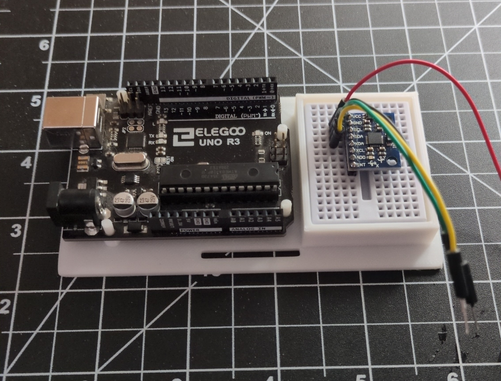
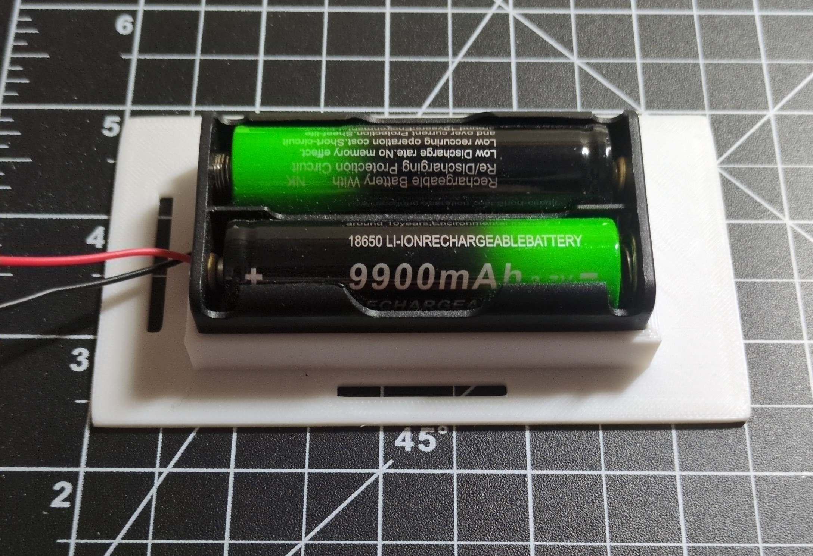
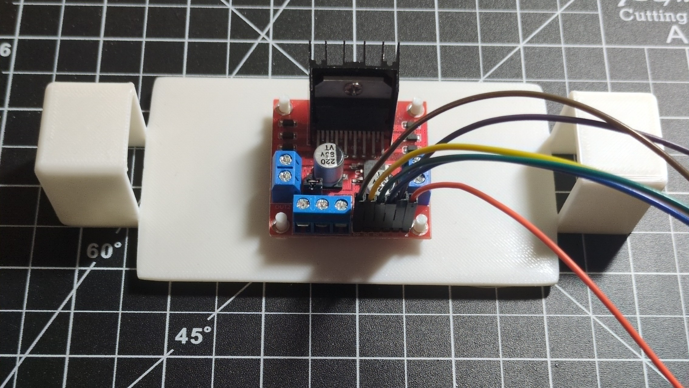
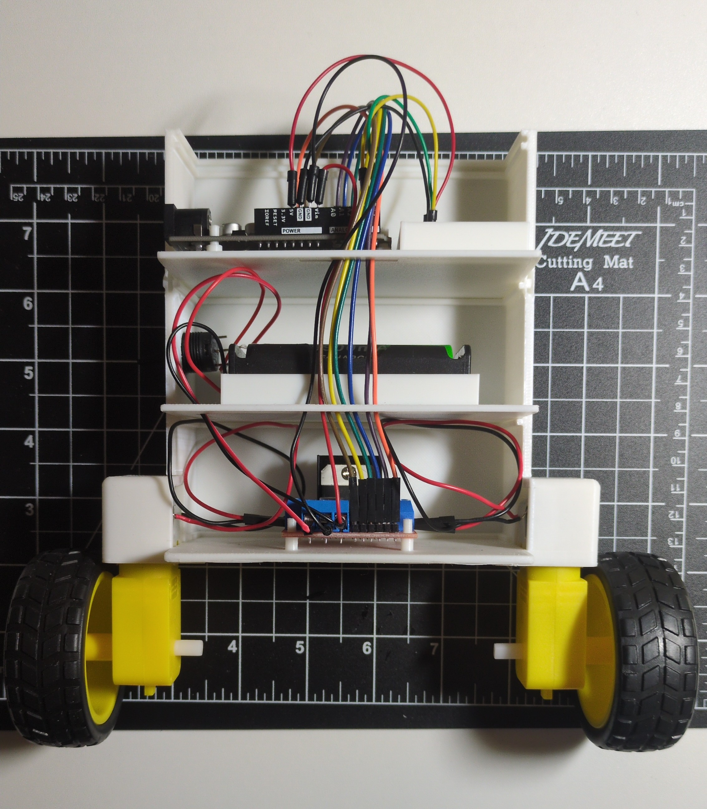

This post is intended to be both a guide and process log on creating a two-wheeled self-balancing robot. It will go over the principles that go into making such a robot, and showcase my thought process and successes/failures during my own implementation. If you've come across this looking to make your own robot, I hope you can learn from what I've done right and (perhaps more importantly) what I've done wrong.

# Demo Video

<iframe src="https://player.vimeo.com/video/1200325665?badge=0&amp;autopause=0&amp;player_id=0&amp;app_id=58479" frameborder="0" allow="autoplay; fullscreen; picture-in-picture; clipboard-write; encrypted-media; web-share" referrerpolicy="strict-origin-when-cross-origin" style="position:absolute;top:0;left:0;width:100%;height:100%;" title="Two-Wheeled Self-Balancing Robot Demo"></iframe>

# Robot Overview
This robot will consist of a box-shaped body on top of two wheels controlled by motors. Its goal is to remain upright, resisting the forces of gravity as well as external disturbances. The angle (perpendicular to the ground) where it is balanced is our target angle. It is worth noting that while the target angle might be $0\degree$, the construction of the robot and its center of gravity relative to the wheel axis could result in a slightly different angle. In this robot's case, I experimentally determined the best target angle to be $-1.25\degree$.

The robot will read the relevant values from an IMU in order to estimate its current tilt angle. It will then feed the difference between this estimate and the target angle to a PD controller, which will then move the motors accordingly. This process repeats in an infinite loop until the robot is powered down.

# Construction
## Parts List
The following components were used to construct the robot:
- 1x Arduino Uno R3 microcontroller
- 1x L298N Motor Driver
- 1x MPU6050
	- in the form of a GY-521 module with breakout pins
- 2x 3.6V LiPo Batteries
- 2x Brushed Gearbox DC Motors with Wheels
	- advertised as rated for 3-6V, 90-200 RPM, 0.15-0.60 Nm

With these materials I sought to minimize costs where I could, and make use of a couple of components I already had. I figured it would be a good exercise to make the most of potentially suboptimal resources, and try to compensate for the limitations of hardware with software. As we'll explore later I may have bitten off more than I could chew in this regard.

## The Body
In my research I noticed that the typical design for this sort of robot was rather barebones, mainly consisting of several plates for the electronics stacked vertically via poles at the corners. While this skeletal frame would surely get the job done, I wanted a more enclosed and hopefully sleeker-looking body for my robot. In addition to a more aesthetically-pleasing exterior I hoped that my design would better serve to contain and protect the electronics. The robot's pieces were designed in Fusion 360 and printed using PLA filament.

The robot's body consists of three plates to hold electronics, which slot into a front and back casing to hold it all together in a rounded box shape. I had initially designed the casing halves to have snap-fit tabs and receptacles for a tight fit, but printed them parallel with the printing axis, making them extremely fragile. Thankfully they turned out to be unnecessary as a simple friction fit has proven to be sufficient. Each electronics plate has pegs and enclosures measured to fit each particular component snugly and prevent movement within the robot, as well as cutouts for passing wires between levels. The casing includes a port for USB access to the Arduino as well as a power switch.

# State Estimation
In order to make the proper corrections to its tilt, the robot first needs a way to determine its orientation so that it can compare to the target angle. There are many sensors that can be used to determine tilt, each with their relative strengths and weaknesses. This robot will use both an accelerometer and gyroscope in the form of the MPU6050 IMU. The IMU will be oriented such that its z-axis points directly upward, and its x-axis is aligned with the wheels and axis of rotation.

The accelerometer measures accelerations across its axes. If we assume the accelerometer is at rest, then the only accelerations it should read are those caused by gravity. Using this knowledge, we can determine the accelerometer's orientation using some simple trigonometry. Assuming that the accelerometer's x-axis is our desired axis of rotation, we can determine the angle of tilt with the following equation:

$$\hat\theta=\text{atan2}(a_y,a_z)$$
where $a_y$ is the accelerometer reading from the y-axis and $a_z$ from the z-axis.

However, this calculation is only accurate when the accelerometer is at rest. While the robot is moving, the accelerometer will read accelerations other than just gravity, and the angle estimate will quickly become inaccurate and noisy.

A gyroscope measures angular velocity about its axes. Starting from a known angle, we can (numerically) integrate the angular velocity readings over time to update our angle estimate.
$$\hat\theta_n = \hat\theta_{n-1}+\omega_n \Delta t$$
Unfortunately, this model is a little too idealized to be useful on its own. Small errors and noise factor into the angle estimate, which future estimates depend on. This causes our current angle estimate to diverge from the true value over time.

Neither the gyroscope nor accelerometer are sufficient on their own for estimating the tilt angle. However, we can use their measurements in tandem to compensate for each other's weaknesses.

## Sensor Fusion
The process of combining data from different sensors to get a more accurate estimate is known as sensor fusion. In our case, we can combine the data from the gyroscope and accelerometer to generate a more accurate estimate of the tilt angle. By incorporating just enough of the accelerometer data to cancel out the gyroscope's noise during integration, we can stabilize our angle estimate.

Sensor fusion can be done using various algorithms of various complexities. This project will use a simple complementary filter to combine sensor data. The complementary filter takes the form of  
$$\hat\theta = (1-\alpha)*(\hat\theta + \omega\Delta t)+\alpha*\hat\theta_\text{accel}$$
and is essentially a way to weight the importance of each sensor. The $\alpha$ value chosen for this filter is $\alpha=0.001$. We include just enough data from the accelerometer to counteract the noise from the gyroscope and keep it on track. Too much reliance on the accelerometer will introduce its own noise as the robot moves, which is undesirable.

It is worth nothing that the complementary filter's $\alpha$ value is static, meaning that our weighting won't change during operation. This may not necessarily be the optimal approach, as there are likely times when the accelerometer data should be more or less prioritized. Other filtering algorithms exist such as the Kalman filter, which can dynamically change weightings based on the system's state for more accurate estimates. However, these methods tend to be more computationally expensive as well as more difficult to implement properly.

## Calibrating Sensors
Before we can get useful measurements from our sensors, we need to calibrate them. No sensor is perfect, and each comes with its own biases across its axes that we'll need to account for. For the purposes of this project, we will assume these biases are constant, although in reality they often vary over time and with factors like temperature.

The calibration process I've used for both the gyroscope and accelerometer is fairly simple. By setting the IMU on a level surface, we know what values should be read on each axis: 0 on all axes for the gyroscope, and 1g on the accelerometer's z-axis with 0's on the others. By averaging the differences between the sensor readings and their known true values over hundreds of readings, we can determine offsets for each sensor and subtract them in subsequent readings to get more accurate values.

The offset values can either be hard-coded into the robot or determined during a startup calibration process in which you hold the robot in the known upright position for several seconds. For ease of use I decided to hard-code the offsets I determined after averaging thousands of samples, so that the robot begins balancing immediately after switching it on.

# PD Control and Motor Driving
A naive approach to balancing the robot would be to simply full-throttle the motors in the direction the robot is falling. This would likely result in extremely erratic back-and-forth motion before promptly ending in a violent faceplant. We can intuitively imagine that the power we send to the motors should depend in some capacity on how tilted the robot currently is, which brings us to our chosen control algorithm: PD.

PD stands for proportional-derivative, which are the two ways we will deal with our error. Given an error signal, it generates a control signal according to
$$\text{control}=k_p*e + k_d*\frac{de}{dt}$$
where $k_p,k_d$ are variables we must choose and tune to optimize behavior. The proportional component is perhaps the most intuitive: the further tilted the robot is, the more power we should send to our motors. The derivative component controls our response to how fast the robot is falling, and can serve to dampen any oscillatory behavior about our target angle. The output produced by the PD algorithm is then sent as a PWM signal to the motor driver. I won't go too in-depth on PWM here, but it is a value ranging from 0-255 that controls how much effective voltage is sent to the motors, with 255 being the maximum amount.

The process of PD tuning can be rather tedious and difficult as we attempt to experimentally determine the optimal values for the coefficients. I personally took a very long time to get decent behavior, although as we'll discuss later, there may have been other factors hindering my progress.

My methodology for determining the PD values was as follows: after setting all the coefficients to 0, I first determined $k_p$ by slowly increasing it until the robot was able to catch itself. At this point it might almost balance, but will likely oscillate back and forth and may eventually fall over. I then moved on to $k_d$, slowly increasing it until the oscillating behavior was dampened. From there I made very slight adjustments to both coefficients until the robot behaved as well as I supposed it could.

An integral component could also be added to form a PID controller. The integral component mostly affects long-term behavior, as it is dependent on the accumulated error (which we would again numerically integrate over time). I had initially tried to work with a full PID algorithm for this robot. However, in this case I found it to introduce some system instability and lag. Because it depends on the accumulated error, it might be slow to adjust once the robot reaches the target angle, which could throw the whole system out of balance perpetually. Ultimately I decided it was unnecessary for this application and cut my controller to just the proportional and derivative components.

# Performance
I had some rather high expectations for this robot's behavior. I wanted it to operate super smoothly and precisely, stay perfectly still and upright, and respond gracefully to disturbances. My robot does balance quite well, but as you can see in the demo video, it still has a slight oscillating behavior. It is by no means erratic, but it struggles to maintain that perfect upright stillness I wanted going in. I tried a couple of tricks to smooth out its behavior, such as including a "rest zone" where the motors do not move when the robot is within $0.75\degree$ of the target angle on either side, which helped reduce some of the oscillatory behavior.

My disappointment could easily be an issue with my expectations as much as it is my tuning; however there are some definite problems I have encountered during this project that are worth mentioning.

# Issues

## Power
I believe that most of the problems with my robot likely stem from a lack of power. In my parts list I mentioned that the robot is powered by 2 3.6V batteries, for a total of 7.2V of power. The motors used are rated for 3-6V, which seems fine. However, I later discovered that the L298N motor driver I used is a rather old piece of technology that is also quite power-hungry, and is known to drop a volt or two on its own. This may mean that my motors are underpowered, which could have thrown off the entire tuning process.

## Motors/Components
The motors I chose for this project are definitely suboptimal. They are very cheap geared DC motors, and probably aren't the most responsive, precise, or powerful. I realized early on that the motors would not start moving below a certain PWM signal value, which I experimentally determined to be around 80. This could be a problem with the motors, the motor driver, or the power supply (or all three). I first tried to work with this by adding this minimum power value to the control signal before constraining it, so that the PWM sent to the motor driver would always be at least 80. However, I wanted the full range of motor speeds to try and get as fine control as possible for my robot and avoid oscillations. I eventually found a sort of workaround by sending a very brief pulse of max power to the motors to "kickstart" them before sending the actual control signal. This seems to have worked fairly well, and I don't think the brief jolt contributes to too much instability or significant sensor noise. I also played with some delays in the code's loop to let the motors to run longer between updates, in an effort to mitigate the effects of the pulses. It is by no means a perfect solution but it's the best I've been able to do with this setup.

Another contributing factor to my motors' weakness could be the robot body itself. I discussed earlier how I wanted my robot body to be more protective and aesthetically-pleasing than other minimal designs; however, I believe the additional plastic might have made the robot significantly heavier, and the motors may have struggled to come up with the torque to move it effectively.

## Future Improvements
The logical next step for improving this robot is to try adding another battery, for a total of 10.8V. Due to the robot's current dimensions, this would require redesigning and reprinting every part of the robot to accomodate the larger battery pack, which is why I haven't yet tried it.

On the topic of redesigning, there are a couple of other changes I would make to my design. Aside from adjusting some of the tolerances and perhaps trying the snap-fit tabs again, I would add more holes in the electronics plates for wires to pass through. I realized during my power issues that the battery pack was somewhat difficult to access with the wires passing in front of it, so I would include options for routing the wires more conveniently. I would also take another crack at the motor enclosures, and try to hold the motors more securely and evenly.

There is also the matter of upgrading materials. I still think that this project had a lot of value in learning to make do with subpar components, but there's a chance that they held me back more than I bargained for, especially regarding the motors. The L298N is quite old and inefficient at this point, and I think I would be better off using a more modern motor driver. This would also have the added benefit of dropping less voltage, which might solve my power issues outright. I could also try upgrading my motors to something with more torque and precision, for smoother adjustments to the robot's tilt. I've seen stepper motors used in these kinds of robots to very impressive effect.

Finally, I would upgrade the code in a few ways. For one, I could try using a more advanced filter like the Kalman filter to reduce noise in the angle estimate. I could also add another controller for controlling the robot's speed, in order to try to keep it from moving back and forth as much.

# Conclusion
As far as getting a robot to balance goes, I think this project was a success. I learned a great deal about sensor fusion, control algorithms, and design over the course of getting this thing to work, and really got to exercise some resourcefulness and troubleshooting skills along the way. If you're looking to make a robot of your own, I hope you found some of the information here useful.

